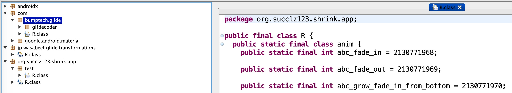
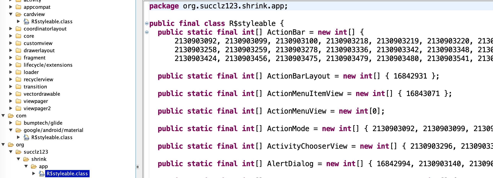

## Android Shrink

A library that can shrink Android R classes. Only support for `com.android.tools.build:gradle:3.6.0+`.

## Usage

~~~
repositories {
    google()
    jcenter()
    maven { url 'https://jitpack.io' }
}
~~~

~~~
dependencies {
    classpath 'com.android.tools.build:gradle:4.0.0'
    classpath 'com.github.succlz123:android-shrink:0.0.2'
}
~~~

~~~
apply plugin: 'org.succlz123.shrink'
~~~

### Keep

~~~
androidShrink {
    keepInfo {
        mipmap {
            packageName = "org.succlz123.nrouter.app"
            resName = ["ic_launcher"]
            resNameReg = ["ic_launcher.*"]
        }
        layout {
            packageName = "org.succlz123.nrouter.app.test"
            resName = ["activity_second"]
        }
        id {
            packageName = "androidx.fragment"
            resNameReg = ["accessibility_.*"]
        }
    }
}
~~~

## Process effect

> Before - 714KB (Debug)

> After - 29KB (Debug)

